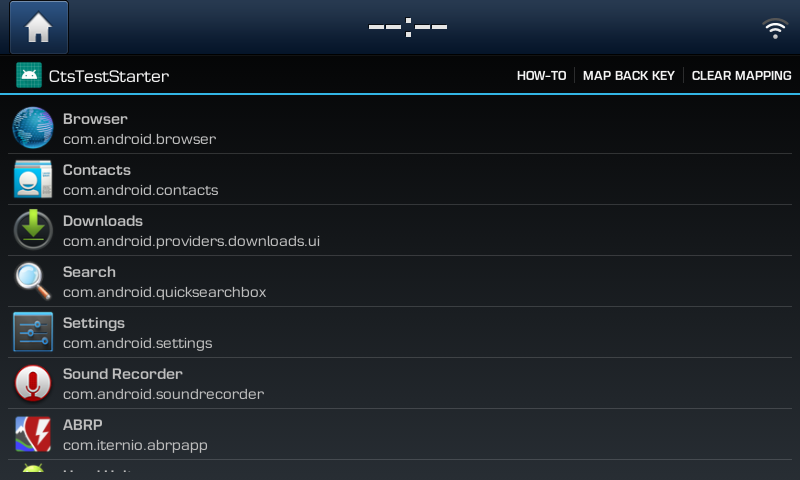

# CTS Test Starter
Allows you to map hardware keys to custom apps.  

**Features: **
* Map long press of hardware keys (except Settings) to any installed app. 
* Map back key event to an hardware button, doesn't require restored stock apps on 191209 software. 

Long press settings button to launch app.
After installing the app press the settings button shortly and long press it afterwards to launch the app.

If you like my work I'd be happy if you buy me a coffee. Thanks! 

