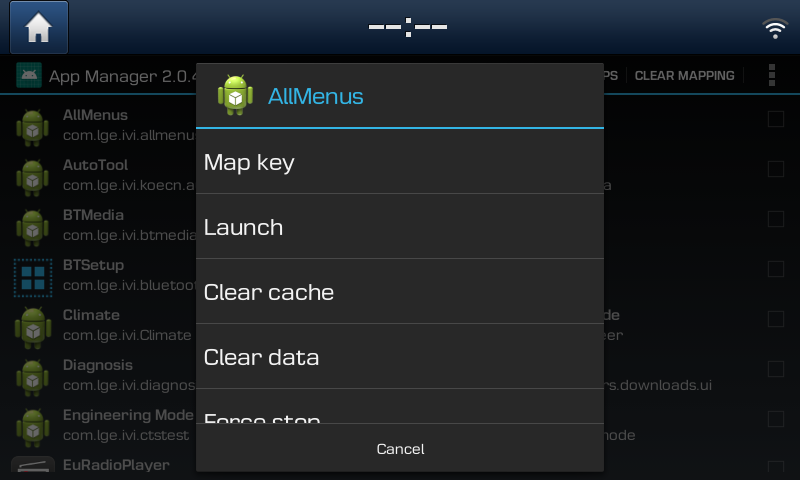

# App Manager

Allows you to map hardware keys to custom apps and manage apps.

## Features:

* Map long press of hardware keys (except Settings) to any installed app.
* Map double press of hardware keys (except Settings) to any installed app.
* Map back key event to an hardware button, doesn't require restored stock apps on 191209 software.
* Clear app cache
* Clear app data
* Force stop app
* Uninstall app
* Restart service when Android OOM kills it

**Long press settings (gearwheel) button to launch the app. Before launching it the first time push
the settings button shortly and long press it afterwards. This is only required after installing the
app for the first time.**

Checkbox for list item will show you if you have mapped a key already.

If you like my work I'd be happy if you buy me a coffee. Thanks!

